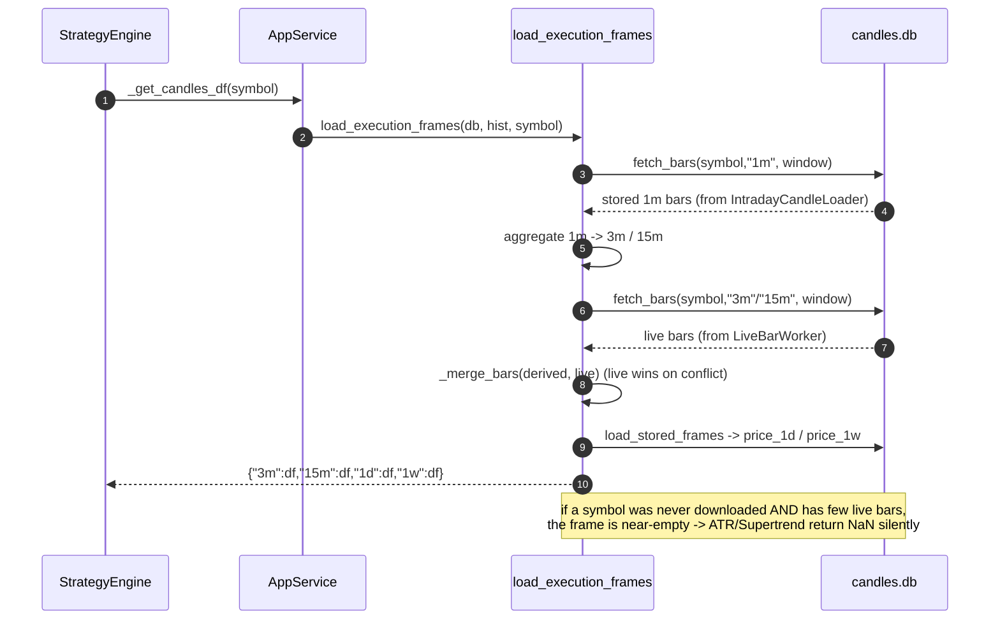
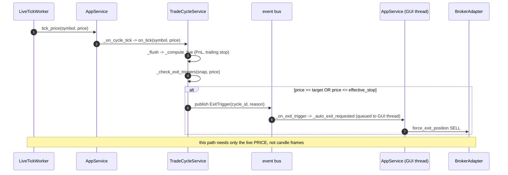
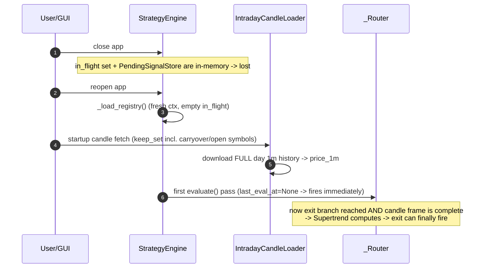

# Execution Architecture — Sequence Diagrams

**Purpose:** Reference for how the strategy-execution system actually calls functions at
runtime — config load, condition evaluation (entry/exit), candle-data assembly, order/fill,
and the two distinct exit paths. Use this when reasoning about execution bugs or changes.

**Scope:** `us_swing/src/us_swing/execution/**` + the `gui/app_service.py` wiring seam.

> Diagrams are [Mermaid](https://mermaid.js.org) `sequenceDiagram` blocks. They render in
> GitHub, VS Code (with a Mermaid extension), and most Markdown viewers. An ASCII summary of
> the threads is at the bottom for quick terminal reading.

---

## Threads (participants used below)

| Participant | Thread | File |
|---|---|---|
| `User/GUI` | Qt main | `gui/*` |
| `AppService` | Qt main | `gui/app_service.py` |
| `StrategyEngine` | own QThread + asyncio loop | `execution/strategy_engine/_engine.py` |
| `_Router` | StrategyEngine loop | `execution/strategy_engine/_router.py` |
| `ConditionEvaluator` | StrategyEngine loop | `execution/strategy_engine/_evaluator.py` |
| `CandleDB` | (DB, any thread) | `intraday_candle_loader.py` read helpers |
| `BrokerAdapter`/`SimBroker` | mixed | `execution/broker_adapter.py`, `broker/*` |
| `OrderIngestion` | engine loop (fills scheduled onto it) | `execution/order_ingestion.py` |
| `TradeCycleService` | own bg-thread + asyncio loop | `execution/trade_cycle/_service.py` |
| `LiveBarWorker` | own QThread | `execution/live_bar_worker.py` |
| `LiveTickWorker` | own QThread | `execution/live_tick_worker.py` |
| `IntradayCandleLoader` | own QThread | `execution/intraday_candle_loader.py` |

---

## 1. Startup — load config, restore cycles, arm feeds

```mermaid
sequenceDiagram
    autonumber
    participant App as AppService
    participant Store as strategy_store
    participant Eng as StrategyEngine
    participant TC as TradeCycleService
    participant Loader as IntradayCandleLoader
    participant Bar as LiveBarWorker

    App->>TC: build_default_service(); start(); reload()
    Note over TC: re-attach tick accumulators for open cycles
    App->>Eng: StrategyEngine(... providers ...).start()
    Eng->>Store: load_strategies()
    Store-->>Eng: list[StrategyConfig] (entry_condition, exit_condition, run_state)
    Eng->>Eng: _load_registry() -> {name: _StrategyContext(cfg, run_state)}
    Note over Eng: in_flight set starts EMPTY here (key on restart)
    App->>App: _boot_candle_check() / screener handoff
    App->>Loader: _start_intraday_loader(keep_symbols)
    Loader->>Loader: download 1m history -> price_1m (per symbol)
    App->>Bar: _start_live_bar_worker(filtered_symbols)
    Bar->>Bar: subscribe 5s bars -> build 3m/15m -> write price_3m/price_15m
```

---

## 2. Evaluation tick — ENTRY condition fires (manual + auto)

> `evaluate()` has **two triggers**, both shown reaching the same method:
> (A) the 1-second `_strategy_tick_loop` (below), and
> (B) a closed live bar — `LiveBarWorker.candle_closed → live_bar_data_updated →
> StrategyEngine.on_candle_closed → _fanout → _Router.evaluate`
> (`app_service.py:1289`, `_engine.py:323/415`).

```mermaid
sequenceDiagram
    autonumber
    participant Eng as StrategyEngine
    participant Router as _Router
    participant DB as CandleDB
    participant Eval as ConditionEvaluator
    participant Pend as PendingSignalStore
    participant Broker as BrokerAdapter

    loop every _TICK_INTERVAL_S (1s), per RUNNING ctx, cadence-gated
        Eng->>Eng: _strategy_tick_loop() -> _is_time_to_evaluate()
        Eng->>Eng: _evaluate_ctx(ctx) : candidates = filtered ∪ open-cycle symbols
        Eng->>DB: _get_latest_bar(symbol,"3m") / _get_candles_df(symbol)
        DB-->>Eng: bar, {"3m":df,"15m":df,"1d":df,...}
        Eng->>Router: evaluate(ctx, symbol, candles, bar)
        Note over Router: guards: emergency / STOPPED / SQUARING_OFF / schedule / accepts / in_flight
        Router->>Router: has_open = has_open_cycle(strategy,symbol) == FALSE
        Router->>Eval: evaluate(ctx.cfg.entry_condition, candles, symbol)
        Eval-->>Router: True
        Router->>Router: in_flight.add(symbol); build ENTRY TradeSignal
        Router->>Router: queue.put(signal)
    end
    Router->>Router: run_router_loop() -> _dispatch(signal)
    alt manual mode OR auto_trade == False
        Router->>Pend: add(signal)  (user must click Buy)
    else auto_trade == True
        Router->>Broker: submit(signal, qty)
    end
```

---

## 3. Order execute → fill → cycle OPEN (entry side)

```mermaid
sequenceDiagram
    autonumber
    participant User as User/GUI
    participant App as AppService
    participant Broker as BrokerAdapter/SimBroker
    participant Ing as OrderIngestion
    participant Eng as StrategyEngine
    participant Router as _Router
    participant TC as TradeCycleService
    participant Life as MonitoringCommand

    User->>App: execute_signal(sig, qty)  (Buy button on pending row)
    App->>Broker: submit(sig, qty)
    Broker->>Ing: register(ctx) BEFORE place_order
    Broker->>Broker: place_order() ; schedule fill onto engine loop
    Broker->>Ing: on_order_event(FILLED)
    Ing->>Eng: fill_sink(FillEvent)
    Eng->>Router: on_order_fill(fill)
    Router->>Router: ctx.in_flight.discard(symbol)   ← clears the entry flag
    Ing->>TC: on_entry_fill(...) -> insert OPEN cycle
    Ing->>Life: mark_entered(symbol)  (ledger ENTERED)
    Note over TC: cycle now OPEN -> next evaluate() takes the EXIT branch
```

---

## 4. Candle-frame assembly (what the indicator actually sees)



---

## 5. Evaluation tick — EXIT condition (e.g. Supertrend)

```mermaid
sequenceDiagram
    autonumber
    participant Eng as StrategyEngine
    participant Router as _Router
    participant Eval as ConditionEvaluator
    participant Pend as PendingSignalStore

    Eng->>Router: evaluate(ctx, symbol, candles, bar)  (open position held)
    Note over Router: if symbol in ctx.in_flight: return (guard sits BEFORE this branch)
    Router->>Router: has_open = has_open_cycle(strategy,symbol) == TRUE
    alt no exit_condition configured
        Router-->>Router: return
    else exit_condition set
        Router->>Eval: evaluate(ctx.cfg.exit_condition, candles, symbol)
        Eval->>Eval: SUPERTREND() -> talib.ATR(frame)
        alt enough bars
            Eval-->>Router: True/False (real value)
        else too few bars
            Eval-->>Router: NaN -> comparison False (NO error, NO log)
        end
        opt fired
            Router->>Router: in_flight.add(symbol); build EXIT TradeSignal; queue.put
            Router->>Pend: (manual) add(EXIT signal)
        end
    end
```

---

## 6. Tick-based exit — target / stop-loss / trailing (separate path)



---

## 7. Why a restart can change behaviour



---

## ASCII thread map (quick reference)

```
GUI THREAD ── AppService ── wires everything, owns providers + Qt signals
   │
   ├─ StrategyEngine (QThread, asyncio) ── _Router.evaluate() ── ConditionEvaluator
   │       entry/exit CONDITIONS ; needs candle FRAMES
   │
   ├─ TradeCycleService (bg thread, asyncio) ── _check_exit_triggers()
   │       target / stop / trailing ; needs live PRICE only
   │
   ├─ LiveBarWorker (QThread) ── 5s bars -> 3m/15m -> price_3m / price_15m
   ├─ LiveTickWorker (QThread) ── tick_price(symbol, price)
   └─ IntradayCandleLoader (QThread) ── 1m history -> price_1m

candles.db: price_1m/3m/15m/1d/1w · trade_cycles · strategies · monitoring_session · trades
```

---

## Key takeaways

1. **`has_open_cycle` picks the branch** — holding the position runs `exit_condition`, otherwise `entry_condition`. Same `candles` frame feeds both.
2. **Two independent exit paths** — strategy-condition exits run in `StrategyEngine` (need candle frames); target/stop/trailing exits run in `TradeCycleService` (need only live price).
3. **`in_flight` guard sits before the exit branch** in `_router.evaluate()` — a stuck flag blocks exits.
4. **Indicators can fail silently** — `Price()` raises on too few bars, but ATR-based indicators (Supertrend) return NaN, which collapses to a quiet "condition false."
5. **In-memory state resets on restart** — `in_flight`, `PendingSignalStore`, and `last_eval_at`; plus the startup loader re-downloads full history. Any of these can make a condition behave differently after a restart.
