# Strategy Routing — Per-Strategy Paper / Live

**Status:** Planned — not started
**Gate:** Do **not** start until the Phase 4 live smoke test has passed
(`Phase4_Live_Smoke_Test.md`, TODO T19)
**Tool:** EXE (+ GUI strategy store, INF schema)
**Created:** 2026-08-28

---

## 0. Goal

Let one strategy trade **live through TWS** while another trades **paper on SimBroker**,
in the same running app, at the same time.

Today the choice is made once, per user, at startup. A user is either paper or live for
everything. That means a new strategy cannot be tried out without either stopping live
trading or running a second copy of the app.

## 1. Why

Paper trading already has two separate homes, and they are not interchangeable:

| Where | What it means |
|---|---|
| **In the tool** | `mode="paper"` → SimBroker. Orders never leave the app. |
| **In TWS** | The user logs into a paper account (`DU…`). Orders leave the app and are filled by IBKR's paper engine. |

A user running TWS on a **real** account has no way to test a new strategy safely — their
only paper option is to switch the whole app to SimBroker and stop trading. That is the
gap this closes.

> **Not in scope:** deciding paper-vs-real from the TWS account id. `mode` describes what
> the *tool* does, not what TWS is.

## 2. How it works today

One broker, built once at startup, used by everything.

```mermaid
flowchart TD
    ENG["StrategyEngine router"]
    GUI["Manual execute - execution_panel"]

    ENG --> SUB
    GUI --> ES["app_service.execute_signal"]
    ES --> SUB["BrokerAdapter.submit"]

    SUB --> ING1["OrderIngestion.register - OrderContext.mode = active user mode"]
    SUB --> BRK{{"self._broker - ONE instance"}}

    BOOT["app_service __init__ - build_broker mode = _users 0 .mode"] -. builds once .-> BRK

    BRK -->|mode = paper| SIM[SimBroker]
    BRK -->|mode = live| IBK["IBKRBroker to IBKRClientGateway to TWS"]

    SIM --> EV[OrderEvent]
    IBK --> EV
    EV --> ING2["OrderIngestion.on_order_event"]
    ING2 --> LED[(trades ledger - has mode column)]
    ING2 --> CYC[(trade_cycles - NO mode column)]
    ING2 --> SINK["fill_sink / reject_sink to engine"]

    style BRK fill:#3a2a00,stroke:#c08000
    style CYC fill:#3a0a0a,stroke:#c04040
```

**The two constraints that make this a real change, not a toggle:**

1. `app_service.py:1305` builds **one** broker and stores it as `self._broker`. There is no
   place to hold a second one.
2. `trade_cycles` has **no `mode` column** (`execution/trade_cycle/_schema.py:16-50`, 33
   columns). A cycle cannot say which broker filled it, so the Active Trades tab cannot
   tell a paper row from a live one.

## 3. How it should work

Two brokers alive at once; the strategy decides which one each order takes.

```mermaid
flowchart TD
    ENG["StrategyEngine router"]
    GUI["Manual execute - execution_panel"]

    ENG --> SUB
    GUI --> ES["app_service.execute_signal"]
    ES --> SUB["BrokerAdapter.submit"]

    SUB --> RT{{"BrokerRouter - NEW - picks by strategy"}}
    CFG[/"StrategyConfig.routing - paper or live"/] -. looked up per signal .-> RT

    RT -->|routing = paper| SIM[SimBroker]
    RT -->|routing = live| IBK["IBKRBroker to TWS"]

    SUB --> ING1["OrderIngestion.register - OrderContext.mode = STRATEGY routing"]

    SIM --> EV[OrderEvent]
    IBK --> EV
    EV --> ING2["OrderIngestion.on_order_event"]
    ING2 --> LED[(trades ledger)]
    ING2 --> CYC[("trade_cycles - plus mode column")]
    ING2 --> SINK["fill_sink / reject_sink to engine"]

    CYC --> AT["Active Trades - Routing column per row"]

    RISK["RiskManager / margin_available - counts LIVE strategies only"] -. gates .-> SUB

    style RT fill:#0a2a1a,stroke:#40a070
    style CYC fill:#0a2a1a,stroke:#40a070
    style RISK fill:#3a2a00,stroke:#c08000
```

## 4. Naming

`Mode` and `Trade Type` are both already taken in the Strategy Executor table, and neither
means paper-vs-live:

| Existing column | Values | Source |
|---|---|---|
| **Mode** | Disabled / Manual / Auto | `strategy_table_model.py:147` → `cfg.mode` |
| **Trade Type** | Intraday / Positional | `strategy_table_model.py:155` → `cfg.trade_type` |

So the new field is **`routing`**, shown as a **Routing** column with values **Paper** and
**Live**. Do not reuse either existing word — a third meaning for "Mode" in the same window
would be worse than the problem being solved.

## 5. Phases

### Phase 1 — Schema and config (no behaviour change)

- `trade_cycles` gains a `mode TEXT NOT NULL DEFAULT 'paper'` column; `CycleSnapshot` gains
  the matching field. **Bundle F5 here** — the deferred partial unique index on
  `(strategy_id, symbol)` for non-terminal states from `T15_Record_Resolution_Audit.md`
  needs the same migration, and doing both once is cheaper than twice.
- `StrategyConfig` (`gui/strategy_store.py`) gains `routing: str = "live"`, persisted in the
  `strategies` table. Default `live` keeps every existing strategy behaving exactly as it
  does now.
- Strategy builder dialog gains a **Routing** combo; strategy table gains the column.

**Test:** migration on a populated DB; round-trip of `routing`; existing rows read back as
`live`. **Risk:** low — nothing reads the new fields yet.

### Phase 2 — BrokerRouter

- New `execution/broker_router.py`: holds a `dict[str, Broker]` keyed by routing value, and
  a `broker_for(strategy_id)` that resolves through the strategy store.
- `app_service` builds **both** brokers at startup. The live one keeps the existing
  fallback-to-Sim on connect failure; when it falls back, live-routed strategies must be
  told loudly, not silently downgraded.
- `BrokerAdapter` takes the router instead of a single `Broker`.

**Test:** contract-style — the same signal through a paper-routed and a live-routed strategy
reaches different brokers; a strategy with no config falls back to paper, never live.
**Risk:** medium — this is the order path. Every existing test must still pass unchanged.

### Phase 3 — Mode threading

- `OrderContext.mode` comes from the strategy's routing, not `mode_provider`.
- `trade_cycles.mode` stamped at open from the same value.
- `get_active_strategy_positions` (`app_service.py:2326`) currently filters
  `p.mode == user_mode` — it must show both, or paper-routed positions disappear.

**Test:** a paper-routed strategy writes `mode='paper'` rows while the user is live; both
show in Pending Signals and Active Trades. **Risk:** medium — the filter widening is the
part most likely to hide rows.

### Phase 4 — Risk and capital separation

**The subtle one, and the reason this is not a small feature.** A paper strategy must not
consume real buying power. `margin_available()` and `RiskManager` count every open cycle
today. If this is missed, a paper test quietly shrinks what the live strategies can trade —
a bug that only shows up on the day the margin was needed.

- `margin_available()` and `RiskManager.can_allocate` count **live-routed cycles only**.
- Paper-routed strategies size against a separate notional pool.

**Test:** open a paper cycle worth $5 000, assert `margin_available()` is unchanged; then a
live cycle, assert it drops. **Risk:** medium-high — silent when wrong.

### Phase 5 — GUI

- Active Trades: the header badge added on 2026-08-28 becomes a per-row **Routing** column.
  The badge itself stays as the *account* indicator (where manual orders go).
- Order confirm dialog shows the strategy's routing, not the user's mode.
- Strategy Executor: **Routing** column, coloured like the badge.

**Test:** pytest-qt on the column and the confirm dialog. **Risk:** low.

## 6. Files

| File | Change |
|---|---|
| `execution/trade_cycle/_schema.py` | `mode` column + F5 partial unique index |
| `execution/trade_cycle/_dto.py` | `CycleSnapshot.mode` |
| `execution/broker_router.py` | **New** — routing table + `broker_for` |
| `execution/broker_adapter.py` | Take the router; stamp `OrderContext.mode` from routing |
| `execution/risk_manager.py` | Count live-routed cycles only |
| `gui/strategy_store.py` | `StrategyConfig.routing` + migration |
| `gui/strategy_builder_dialog.py` | Routing combo |
| `gui/strategy_table_model.py` | Routing column |
| `gui/active_cycles_model.py` | Routing column |
| `gui/app_service.py` | Build both brokers; widen the position filter; `margin_available` |

## 7. Out of scope

- Reading the TWS account id to infer paper-vs-real. Deliberately rejected — see §1.
- Per-user brokers. The engine is a single active-user registry; this plan keeps that.
- A second TWS connection. Both brokers share the one order client id (15).

## 8. Carried forward

These were deferred by `IBKR_Live_Execution_Plan.md` (now retired — its Phases 0–4 are
merged, see `RN-EXE-1.32.0` / `RN-EXE-1.32.1`) and are still open. They are unrelated to
routing, but this is where the list now lives:

- **Phase 5** — dashboard order routing. Square Off All / Manage are blocked in live mode
  rather than routed.
- **Phase 6** — reconnect-mid-order resync. A fill that lands while TWS is away is lost.
- **Phase 8** — startup reconciliation (FO-EXE-002). The app does not read back open
  positions on boot.
- **FO-EXE-003** — circuit breaker + emergency flatten. SRDs are still Draft.
- **Order pacing** — deliberately skipped; `PacingQueue` is the historical-data limiter
  (50 / 600 s) and would block a stop-loss exit for minutes. Needs its own limiter.
